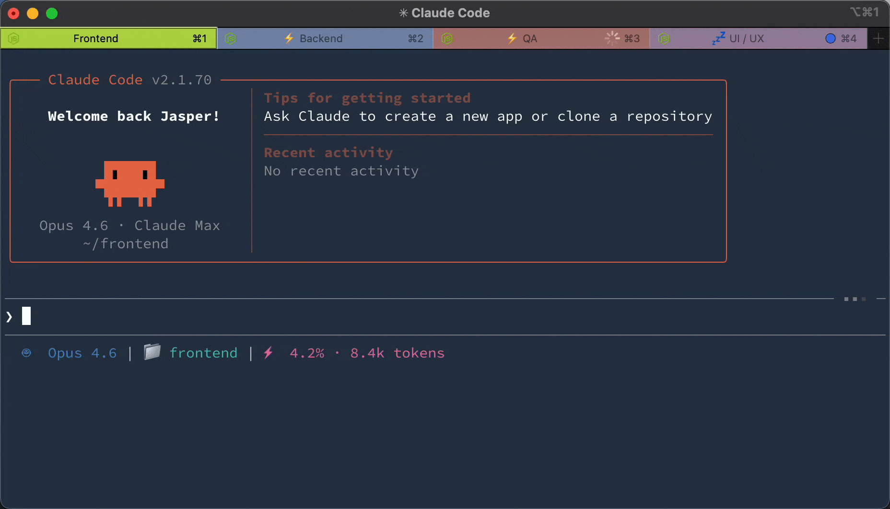
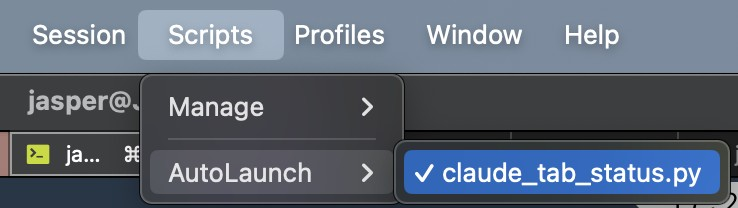

# Claude Code iTerm2 Tab Status

[](https://github.com/JasperSui/claude-code-iterm2-tab-status/actions/workflows/ci.yml)
[](https://opensource.org/licenses/MIT)

**See what every Claude Code session is doing.** Each iTerm2 tab shows a status prefix. ⚡ running, 💤 idle, or 🔴 needs attention (with flashing).



## Installation

### Claude Code (via Plugin Marketplace)

In Claude Code, register the marketplace first:

```bash
/plugin marketplace add JasperSui/jaspersui-marketplace
```

Then install the plugin from this marketplace:

```bash
/plugin install iterm2-tab-status@jaspersui-marketplace
```

On first session start, the plugin automatically:
1. Creates an iTerm2 Python runtime (if not already installed)
2. Deploys the adapter script to iTerm2 AutoLaunch

After the first session, **restart iTerm2** (or toggle **Scripts** → **AutoLaunch** → **claude_tab_status.py** twice).




### Manual Setup

If auto-bootstrap didn't work, run:

```
/iterm2-tab-status:setup
```

### Uninstall

Run in Claude Code:
```
/iterm2-tab-status:uninstall
```

Then remove the plugin:
```bash
claude plugin uninstall iterm2-tab-status
```

## Three states

| State                              | Prefix | Tab Color      | Badge | Dismiss on Focus |
| ---------------------------------- | ------ | -------------- | ----- | ---------------- |
| **Running** — Claude is processing | ⚡      | No change      | No    | No               |
| **Idle** — Claude finished         | 💤      | No change      | No    | No               |
| **Attention** — needs permission   | 🔴      | Flashes orange | Yes   | Yes              |

Lifecycle: `User submits → ⚡ → Claude finishes → 💤 → User submits → ⚡ → Claude needs permission → 🔴 flash! → User focuses → cleared`

Your original tab color, title, and badge are saved and restored.

## How it works

```
Claude Code hooks → JSON signal file → iTerm2 adapter → tab status
```

No screen scraping. Claude Code's official [hooks API](https://docs.anthropic.com/en/docs/claude-code/hooks) writes a signal file on every event. The unified hook handles both `UserPromptSubmit` (→ running) and `Notification` (→ idle/attention). The iTerm2 adapter polls for signal files and sets the matching tab's prefix, color, and badge by TTY. Only the attention state flashes and shows a badge — running and idle are informational prefixes that persist.

## Configuration

The easiest way to configure is with the slash command in Claude Code:

```
/iterm2-tab-status:config
```

This opens an interactive prompt to change flash color, prefixes, badge, notifications, and more.

### Config file

Settings are stored in `~/.config/claude-tab-status/config.json`. Example with all keys and their defaults:

```json
{
  "signal_dir": "/tmp/claude-tab-status",
  "color_r": 255,
  "color_g": 140,
  "color_b": 0,
  "flash_interval": 0.6,
  "prefix_running": "⚡ ",
  "prefix_idle": "💤 ",
  "prefix_attention": "🔴 ",
  "badge_text": "⚠️ Needs input",
  "badge_enabled": true,
  "notify": false,
  "sound": "",
  "log_level": "WARNING"
}
```

The config file is **hot-reloaded** — changes take effect within ~1 second, no restart needed.

### Priority order

Settings are resolved in this order (highest wins):

1. **Environment variable** (e.g. `export CLAUDE_ITERM2_TAB_STATUS_COLOR_R=255`)
2. **Config file** (`~/.config/claude-tab-status/config.json`)
3. **Built-in defaults**

Environment variables are useful for CI or per-machine overrides without touching the config file.

<details>
<summary>Environment variable reference</summary>

| Variable                                    | Default                  | Description                                     |
| ------------------------------------------- | ------------------------ | ----------------------------------------------- |
| `CLAUDE_ITERM2_TAB_STATUS_DIR`              | `/tmp/claude-tab-status` | Signal file directory                           |
| `CLAUDE_ITERM2_TAB_STATUS_COLOR_R`          | `255`                    | Flash color red (0-255)                         |
| `CLAUDE_ITERM2_TAB_STATUS_COLOR_G`          | `140`                    | Flash color green (0-255)                       |
| `CLAUDE_ITERM2_TAB_STATUS_COLOR_B`          | `0`                      | Flash color blue (0-255)                        |
| `CLAUDE_ITERM2_TAB_STATUS_INTERVAL`         | `0.6`                    | Flash interval in seconds                       |
| `CLAUDE_ITERM2_TAB_STATUS_PREFIX_RUNNING`   | `⚡ `                     | Running state prefix                            |
| `CLAUDE_ITERM2_TAB_STATUS_PREFIX_IDLE`      | `💤 `                     | Idle state prefix                               |
| `CLAUDE_ITERM2_TAB_STATUS_PREFIX_ATTENTION` | `🔴 `                     | Attention state prefix                          |
| `CLAUDE_ITERM2_TAB_STATUS_BADGE`            | `⚠️ Needs input`          | Badge text (attention only)                     |
| `CLAUDE_ITERM2_TAB_STATUS_BADGE_ENABLED`    | `true`                   | Enable/disable badge (attention only)           |
| `CLAUDE_ITERM2_TAB_STATUS_NOTIFY`           | `false`                  | macOS notification (attention only)             |
| `CLAUDE_ITERM2_TAB_STATUS_SOUND`            | *(empty)*                | Sound file path (attention only)                |
| `CLAUDE_ITERM2_TAB_STATUS_LOG`              | `WARNING`                | Log level (`DEBUG`, `INFO`, `WARNING`, `ERROR`) |

</details>

## Troubleshooting

**Tab doesn't show status** — Check that the iTerm2 Python Runtime is installed. Verify signal files are created: `ls /tmp/claude-tab-status/` after Claude goes idle. Set `export CLAUDE_ITERM2_TAB_STATUS_LOG=DEBUG` and check iTerm2's script console (Scripts → Manage → Console).

**Wrong tab gets prefix** — The TTY in the signal file doesn't match the iTerm2 session. Restart iTerm2.

## Contributing

See [CONTRIBUTING.md](CONTRIBUTING.md).

## License

[MIT](LICENSE)

---

If this plugin saves you tab-switching time, consider giving it a ⭐!
